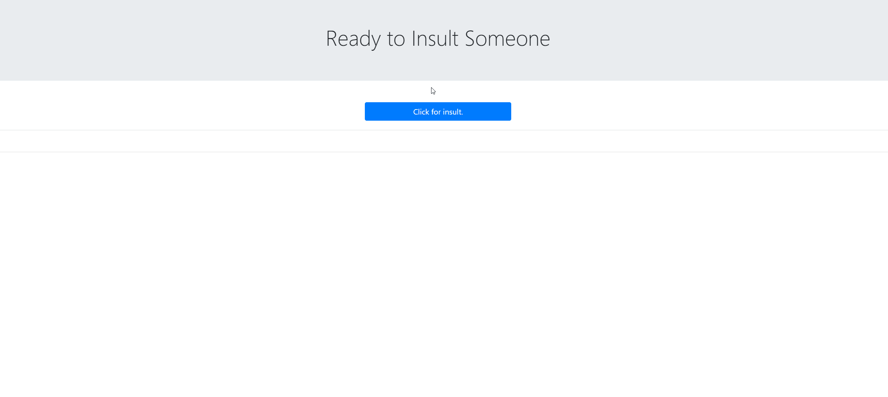

# Insult Me
 

 
### Table of Contents:
* [User Story](##-User-Story)
* [Description](##-Description)
* [Installation](##-Installation)
* [Credits](##-Credits)
* [Contributors](##-Contributors)
* [License](##-License)
 
## Deployed site
[Insult Me](https://enevarez-ops.github.io/insultMe/)

 
## User Story
AS A bored individual running out of ways to insult people. I WILL randomly generate a new insult to use with this app.
 
## Description
Generates a new insult when pressing the Insult Me button.
 
## Installation
Run on default Browser
 
## Contributors
Efrain Nevarez
 
## Credits
JQuery, HTML, CSS, BOOTSTRAP CDN, EVIL GENIUS API
 
## License
This project is licensed by MIT